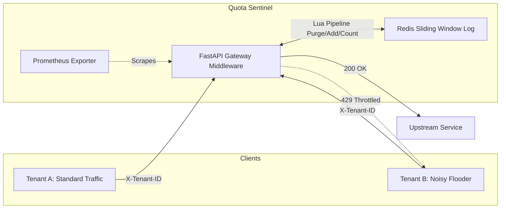

# Quota Sentinel

> **Note:** This repository is a personal learning project designed to explore multi-tenant rate limiting, fair resource distribution, and noisy-neighbor isolation. It is not an enterprise-grade or production-ready platform.

## Overview
Quota Sentinel is a lightweight multi-tenant API gateway demonstration. It explores the central challenge of shared infrastructure: **how do you guarantee fairness when multiple tenants share one system, preventing one bad actor from degrading service for everyone else?**

Using a FastAPI gateway backed by atomic Redis Lua scripts, this project demonstrates that a "noisy neighbor" aggressively flooding the gateway is strictly isolated and throttled, allowing compliant tenants to maintain 100% availability.

## Architecture

## Live Dashboard Evidence


*Real-time Grafana telemetry during the noisy-neighbor test: `tenant-noisy` is throttled at 75+ req/s while `tenant-standard` and `tenant-free` experience 0% degradation.*
## Documentation
The complete evolution of the project, including design decisions and actual test evidence, is documented across three files:

1. [Design Decisions & Trade-offs](docs/tradeoffs.md): Architectural evaluations covering Sliding Window Logs vs. Token Buckets, in-memory tier lookup vs. external databases, bounded metric cardinality, and rejection mechanics.
2. [Noisy-Neighbor Fairness Test](docs/fairness-testing.md): The core load-testing scenario, definition of fairness in measurable terms, and execution data proving tenant isolation under saturation.
3. [Endpoint & Behavior Verification](docs/verification.md): Raw curl outputs and test suite logs verifying baseline gateway behavior across all development milestones.

## Quickstart
1. Start Infrastructure
```bash
docker compose up -d
```
2. Run Gateway
```bash
python3 -m venv .venv
source .venv/bin/activate
pip install -r requirements.txt
uvicorn app.main:app --host 0.0.0.0 --port 8000
```
3. Run Automated Tests
```bash
pytest -v
```
4. Run Noisy-Neighbor Simulation
```bash
# Using k6
k6 run load-test.js

# Or using Python async driver
python tests/simulate_noisy_neighbor.py
```

